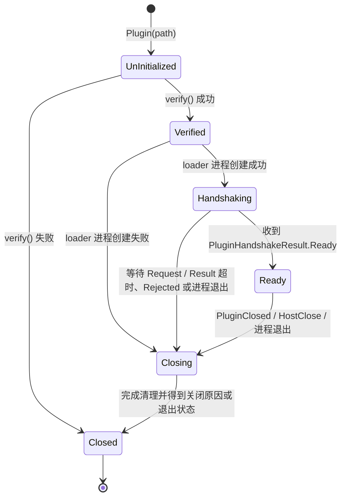
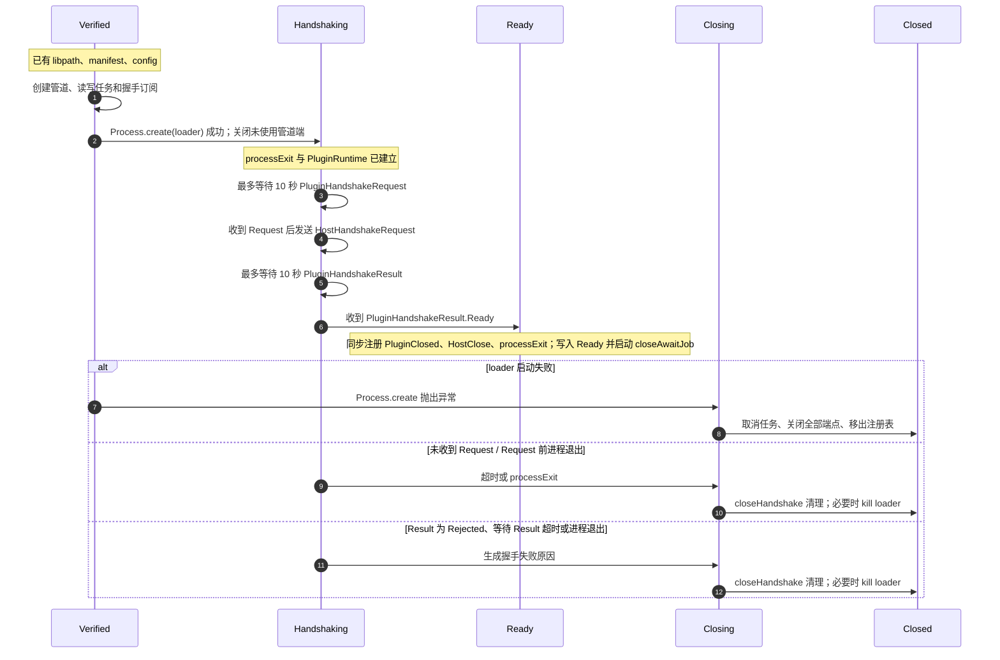
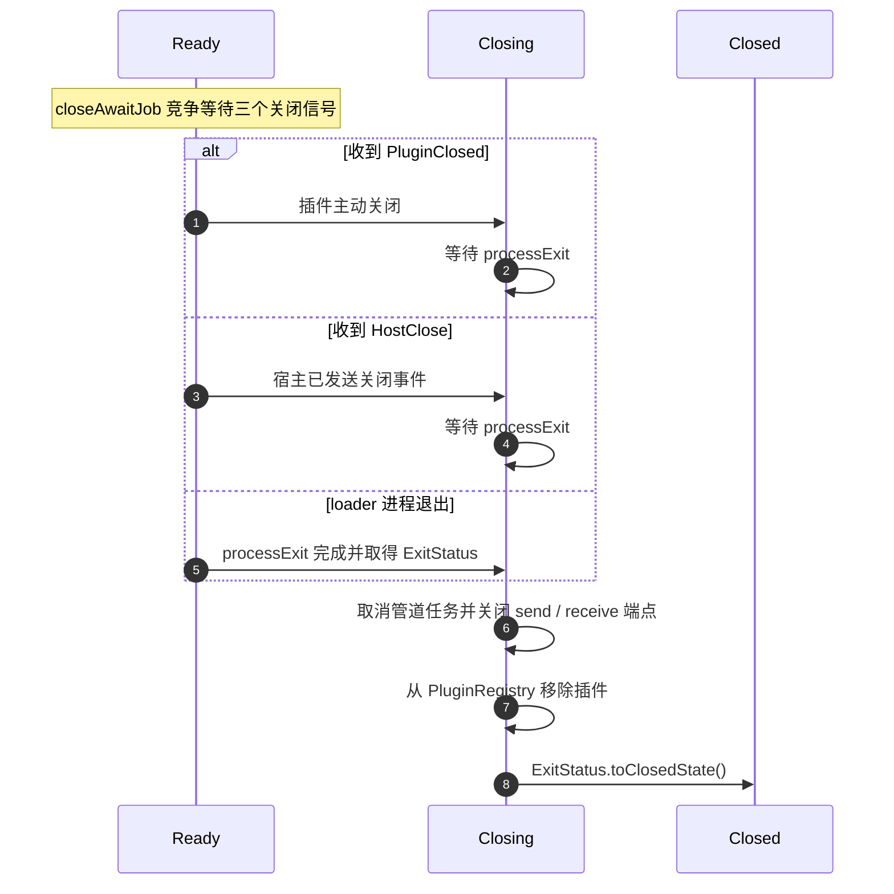

# 插件生命周期

本文档以宿主侧 [`handshake.kt`](../core/src/commonMain/kotlin/top/kagg886/milky/console/plugin/lifecycle/handshake.kt)、[`ready.kt`](../core/src/commonMain/kotlin/top/kagg886/milky/console/plugin/lifecycle/ready.kt) 与 [`close.kt`](../core/src/commonMain/kotlin/top/kagg886/milky/console/plugin/lifecycle/close.kt) 为准，描述单个 `Plugin` 的状态和资源清理顺序。

`Plugin.State` 是宿主观察插件生命周期的唯一状态源；loader 进程与动态库的内部状态不直接映射到 `Plugin.State`。

## 状态

| 状态 | 状态中保存的数据 | 写入时机 |
| --- | --- | --- |
| `UnInitialized` | 无 | `Plugin(path)` 创建后的初始状态。 |
| `Verified` | 动态库路径、解析后的 manifest、运行配置 | `verify()` 成功后。 |
| `Handshaking` | 与 `Verified` 相同 | loader 进程已创建，宿主已关闭自己不使用的两端管道后。 |
| `Ready` | 动态库路径、manifest、配置、loader `Process`、收发管道任务、`closeAwaitJob` | 已同步注册三类关闭监听（插件关闭、宿主关闭、进程退出）后；随后启动 `closeAwaitJob`。 |
| `Closing` | 无 | 握手失败进入清理，或 `Ready` 状态下首先收到关闭信号时。 |
| `Closed(exception?)` | 可选异常原因 | 资源清理完成后，或校验阶段直接失败时。`exception == null` 表示 loader 以退出码 `0` 正常结束。 |

## 状态迁移

`Closing` 是短暂状态：没有后台任务会将 `Closed` 再转换为其他状态。验证失败不经过 `Closing`，因为此时尚未创建进程或运行期资源。

## 握手与进入 Ready

进入 `Handshaking` 前，宿主会创建两条单向匿名管道：一条用于宿主发送到 loader，另一条用于 loader 回传宿主。管道读写任务以及 `PluginHandshakeRequest`、`PluginHandshakeResult` 的 EventBus 订阅均会在创建 loader 前注册，避免 loader 过早发送事件而丢失。

下图只描述**同一个 `Plugin` 实例**的内部时序。横轴是该实例依次处于的 `Plugin.State`；箭头上的文字表示触发状态前进的事件或动作，而非多个独立参与者之间的调用。

### 握手等待规则

1. loader 创建成功后，状态写为 `Handshaking`，并创建只会调用一次的 `processExit = process.await()`。
2. 宿主在 10 秒内竞争等待 `PluginHandshakeRequest` 与 loader 进程退出。只有收到 Request 后，才向该插件发送 `HostHandshakeRequest`。
3. 随后再在 10 秒内竞争等待 `PluginHandshakeResult` 与进程退出。若进程在回传结果后立即退出，宿主会先等待接收管道读取结束；若缓冲区中已有 Result，则优先采用该 Result。
4. 接收管道异常关闭时，读取任务会发布 `PluginHandshakeResult.Rejected(PROCESS_EXITED)`，使握手通过正常的失败分支收敛。
5. 只有 `PluginHandshakeResult.Ready` 会调用 `enterReady()`；所有其他结果都调用 `closeHandshake()`。

## Ready 后关闭

`enterReady()` 会先以 `UNDISPATCHED` 方式注册三个监听，再写入 `Ready` 并启动惰性的 `closeAwaitJob`。因此一旦外部观察到 `Ready`，关闭监听已经存在。

这里的 `HostClose` 是由宿主其他逻辑写入 EventBus 的事件；`closeAwaitJob` 本身不再向 loader 补发关闭消息。对于 `PluginClosed` 和 `HostClose`，它会等待 loader 自行退出；对于进程退出信号，则直接使用已取得的退出状态。

退出状态到 `Closed` 的映射如下：

| `Process.ExitStatus` | `Closed.exception` |
| --- | --- |
| `Result(exitCode = 0)` | `null` |
| `Result(exitCode != 0)` | `IOException("process exited with exit code <code>")` |
| `Killed` | `IOException("process killed")` |

## 握手失败时的清理

`closeHandshake()` 固定执行以下顺序：

1. 写入 `Closing`。
2. 取消发送和接收管道任务，并尽力关闭两个端点。
3. 若 `processExit` 尚未完成，终止 loader 进程；随后等待进程退出。
4. 从 `PluginRegistry` 移除插件。
5. 以调用方提供的握手异常写入 `Closed`，并返回 `false`。

loader 进程创建失败时没有 `PluginRuntime`，但 `handshake()` 会执行等价的任务取消与管道关闭，然后移除插件并写入 `Closed(PluginhandshakeFailedException(PROCESS_START_FAILED))`。

## 注册表移除时机

- 校验失败的插件从未加入注册表。
- loader 创建失败和所有握手失败路径都会在写入 `Closed` 前调用 `PluginRegistry.remove()`。
- 已进入 `Ready` 的插件由 `closeAwaitJob` 在关闭端点后、写入 `Closed` 前移除。

`PluginRegistry.make()` 的异步握手调用在 `handshake()` 返回 `false` 时还会再次尝试移除同一插件；由于注册表使用集合，这个重复移除不会改变最终结果。
