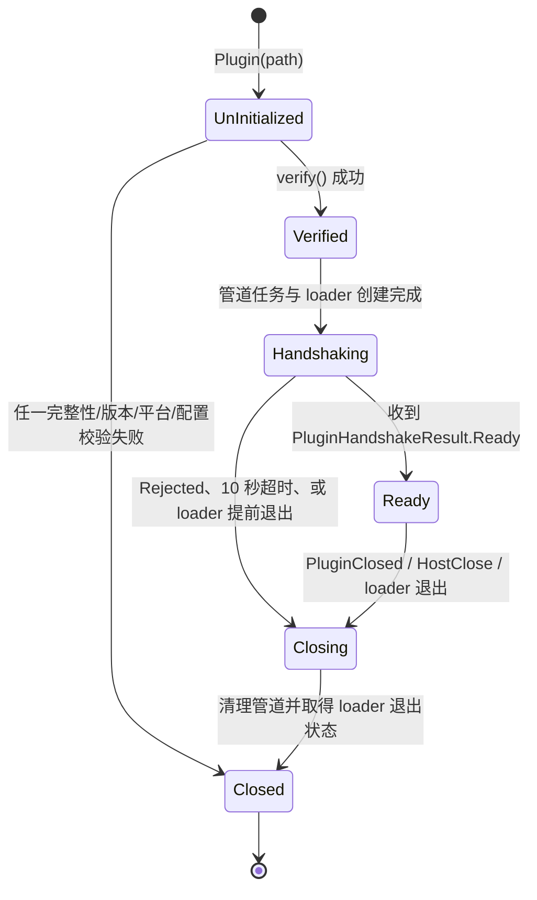
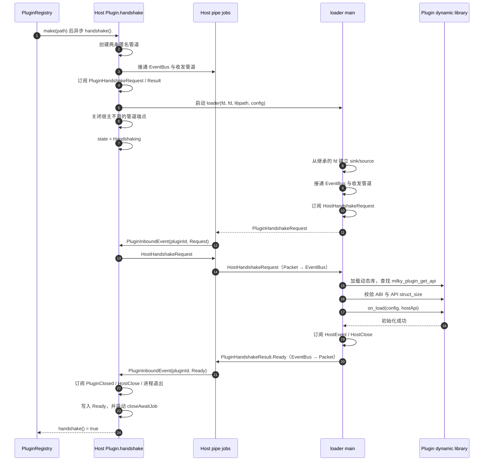
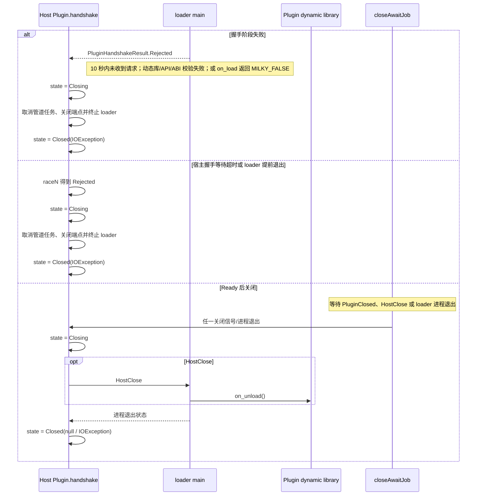

# 插件生命周期

本文档以当前 `PluginRegistry.make`、`Plugin.handshake` 与 loader 的 `main` 实现为准，描述宿主侧 `Plugin.State` 的状态迁移，以及宿主与 loader 的握手时序。

## 状态与触发条件

| 状态 | 携带的数据 | 进入条件 | 后续状态 |
| --- | --- | --- | --- |
| `UnInitialized` | 无 | `Plugin(path)` 刚创建时的初始值。 | `verify()` 通过后进入 `Verified`；任一校验失败直接进入 `Closed`。 |
| `Verified` | 动态库路径、`manifest`、默认配置 | `verify()` 已验证清单、版本、当前平台动态库及默认配置。`PluginRegistry.make()` 随后把插件加入注册表，并异步调用 `handshake()`。 | loader 进程创建完成后进入 `Handshaking`。 |
| `Handshaking` | 与 `Verified` 相同 | `handshake()` 已先接通管道与 EventBus、订阅 `PluginHandshakeRequest/Result`，再创建 loader 进程并写入 `Plugin.State.Handshaking`。宿主收到 `PluginHandshakeRequest` 后才发送 `HostHandshakeRequest`。 | 收到 `PluginHandshakeResult.Ready` 后进入 `Ready`；收到 `Rejected`、等待 10 秒超时或 loader 提前退出后由 `close.kt` 依次进入 `Closing`、`Closed`。 |
| `Ready` | 动态库路径、`manifest`、配置、loader `Process`、收发管道任务及关闭等待任务 | loader 完成动态库、ABI/API 和 `on_load` 检查，并在设置运行期监听后回传 `PluginHandshakeResult.Ready`；宿主设置全部关闭监听后才写入。 | 收到插件 `PluginClosed`、宿主 `HostClose`，或 loader 进程退出时进入 `Closing`。 |
| `Closing` | 无 | 握手失败；或 `closeAwaitJob` 的三路竞争任一路先完成：插件发出 `PluginClosed`、宿主发出对应插件的 `HostClose`，或 loader 进程退出。 | 清理管道并等待/取得 loader 最终退出状态后进入 `Closed`。 |
| `Closed(exception?)` | 可选关闭原因 | 校验失败；握手被拒绝、超时或 loader 在握手完成前退出；或 `Closing` 后 loader 被杀死/以非零码退出。loader 正常以 `0` 退出时 `exception` 为 `null`。 | 终态；注册表会在握手失败或正常关闭流程结束后移除该插件。 |

### 校验失败的具体触发条件

`verify()` 会将插件直接从 `UnInitialized` 置为 `Closed`，触发条件包括：

- 缺少或无法读取/解析 `manifest.json`，包括缺失 `id`、`manifest_version` 或 `protocol_version`。
- manifest/protocol 版本不在宿主支持范围，或完整 `PluginManifest` 反序列化失败。
- 缺少 `platform` 目录、当前操作系统/CPU 架构对应的动态库，或当前平台不受支持。
- `default-config.json` 存在但不是有效 JSON 对象。

### 状态图

## 正常握手时序

宿主在启动 loader 前创建两条单向匿名管道：宿主到 loader 的发送管道，以及 loader 到宿主的接收管道。两端都先启动对应的管道收发协程；消息会经过 `Packet` 编解码、必要时的分包合并，再进入 `EventBus`。

## 拒绝与关闭时序

## loader 侧的结束行为

握手成功后，loader 订阅 `HostEvent` 并调用插件 `on_message`；收到 `HostClose` 时取消消息循环。退出前它调用 `on_unload`、释放 host API、关闭管道与动态库，并以 `on_unload` 的返回码退出。

## 注册表移除时机

握手失败时，`PluginRegistry.make()` 的异步任务会移除该插件；`Ready` 插件完成关闭流程后，`closeAwaitJob` 会在写入 `Closed` 后调用 `PluginRegistry.remove()` 移除该插件。
